# How to Configure Microsoft Azure Entra ID SSO on Omada Controller

Since version 5.15.16, Omada Controller supports Single Sign-On (SSO). This feature allows you to log in to the Omada Controller using an account from a third-party Identity Provider (IdP) such as Microsoft Azure Entra ID. SSO offers enhanced security and streamlined account management for your organization. For example, when an employee leaves the company, simply removing their account from the IdP will automatically revoke their access to the controller.

## Prerequisites
* Omada Controller 5.15.16 or above.

**Note**: Omada SSO currently supports only IdP-initiated SSO, meaning the SSO flow can only be started from the IdP endpoint. This typically requires you to have an app portal.

The following example uses Omada Cloud-Based Controller 5.15.20 and Microsoft Azure to demonstrate how to configure SSO on Omada.

## Microsoft Azure Configuration (Part 1)
### Create an Application
Log in to Microsoft Azure
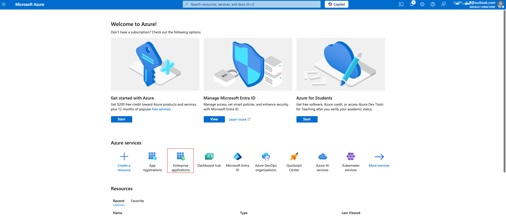
and go to **Enterprise Applications**. Click **New application** → **Create your own application**, and give your application a name.
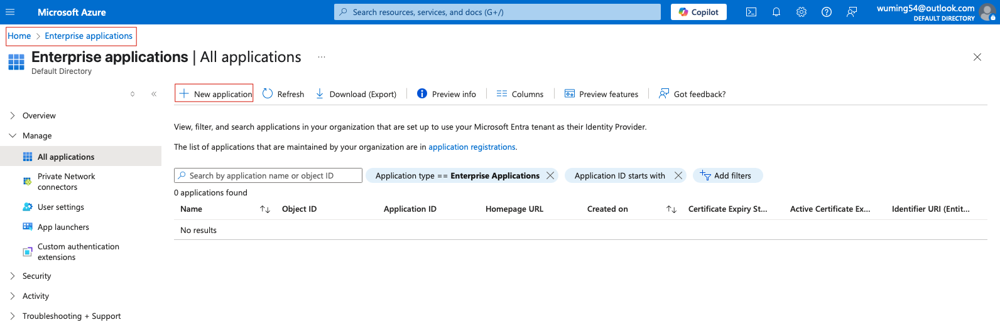
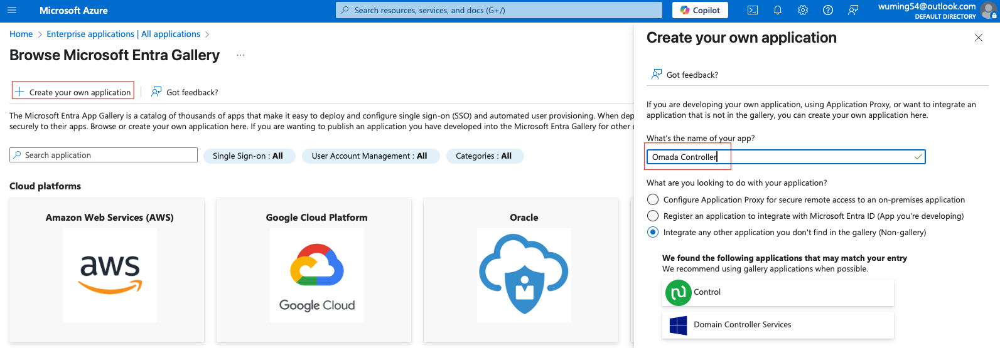

### Get the App Federation Metadata URL
Within the created application, choose **Set up single sign on** and select **SAML**.
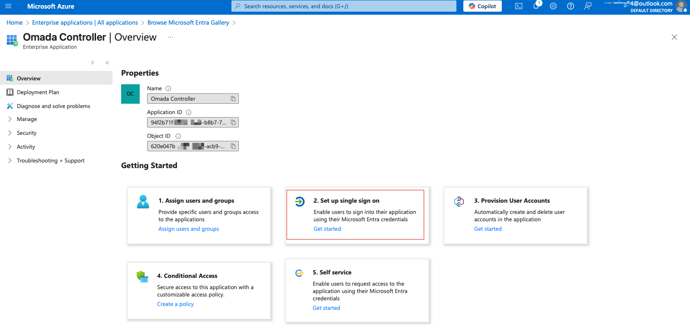
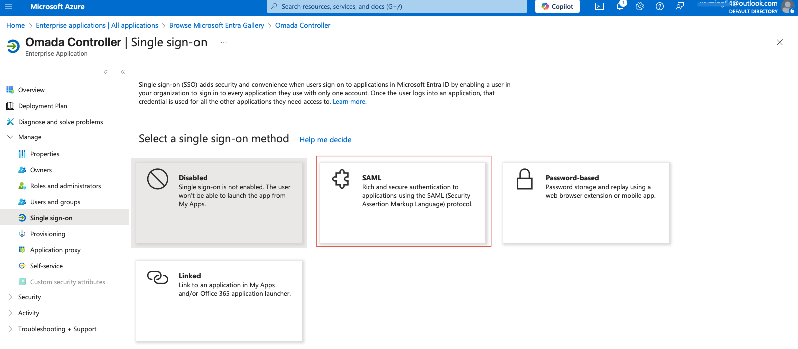
At this point, you don't yet have the information needed to set up SAML on this page.
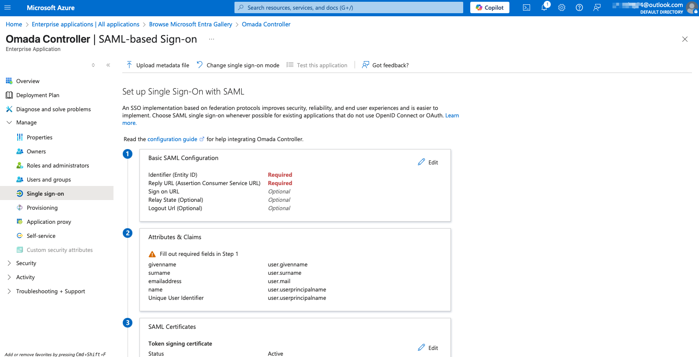
Go to **SAML Certificates** and copy the **App Federation Metadata URL**.
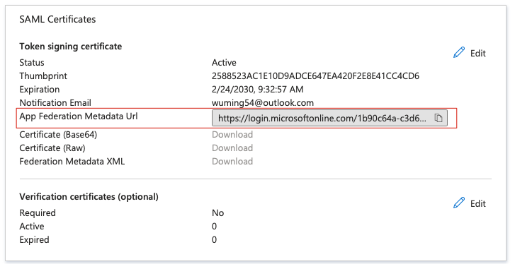

## Omada Controller Configuration
### Create the SAML Connection
Log in to the Omada Controller and navigate to **MSP View** (or **Global View** if you are not using MSP mode) → **Settings** → **SAML SSO**.
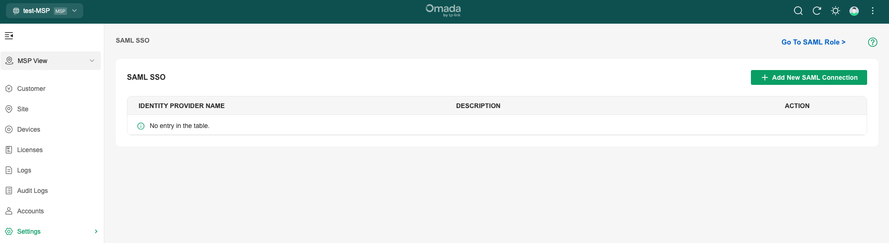
Add a new SAML Connection, set **Configuration Mode** to **Metadata URL**, paste the URL you copied in the previous step, click **Load Info**, and then click **Send** to register.
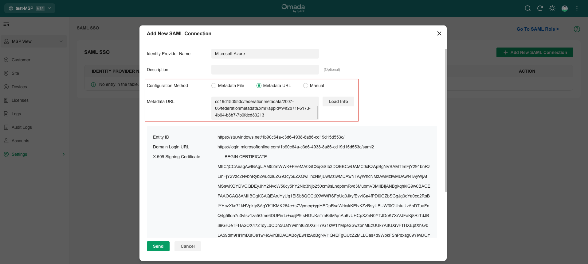
By clicking the menu icon, you can now find all the information needed for SAML configuration, including **Entity ID**, **Sign-On URL**, **Omada ID**, and **Resource ID**.
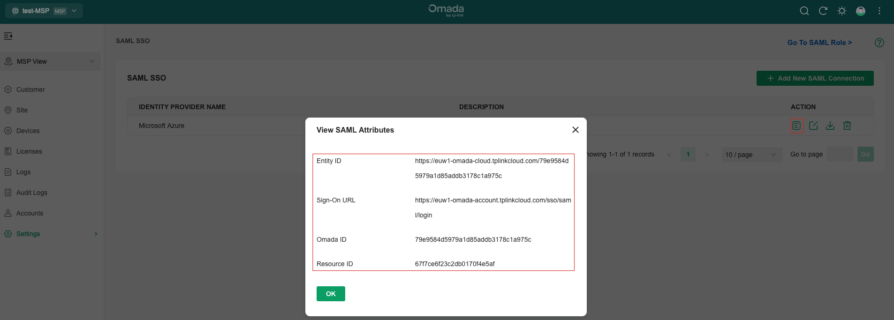

### Create the SAML Role
Click **Go to SAML Role** in the top-right corner to be redirected to the SAML role configuration page.
Here, we create a SAML role named **Omadasuperadmin** and select the MSP role and Customer role as needed.
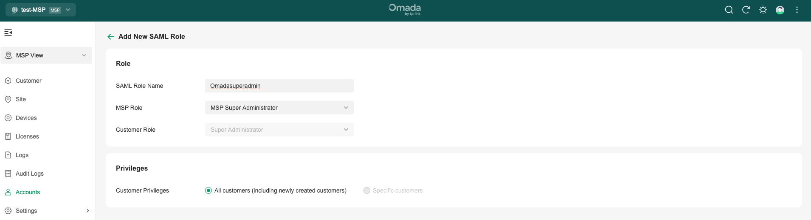

## Microsoft Azure Configuration (Part 2)
### Basic SAML Configuration
Return to **Microsoft Azure** → **Enterprise applications** → **Omada Controller** → **Manage** → **Single Sign-on** → **SAML**, and edit the **Basic SAML Configuration**.
You need to fill in **Identifier (Entity ID)**, **Reply URL (Assertion Consumer Service URL)**, and **Relay State (Optional)** as shown below.

Please note:
* The **Reply URL (Assertion Consumer Service URL)** corresponds to the **Sign-On URL** value from the Omada Controller. You don't need to configure **Sign on URL** in Microsoft Azure, as Omada Controller does not currently support SP-initiated SSO.
* **Relay State (Optional)** is the Base64-encoded value of **Resource ID_Omada ID**. You can generate this value using a Python script or an online tool such as https://www.base64encode.net.

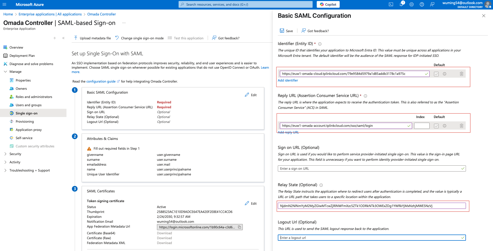

### SAML Attributes & Claims
Click **Edit** to create new claims.
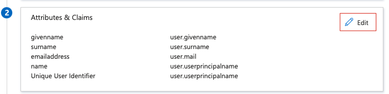
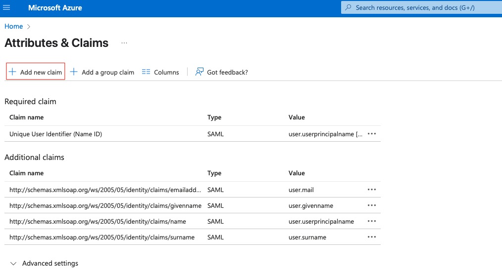
We need to create two additional claims: **usergroup_name = user.assignedroles** and **username = user.displayname**, as shown below.
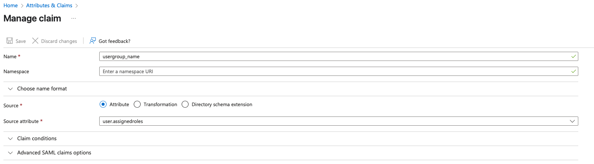
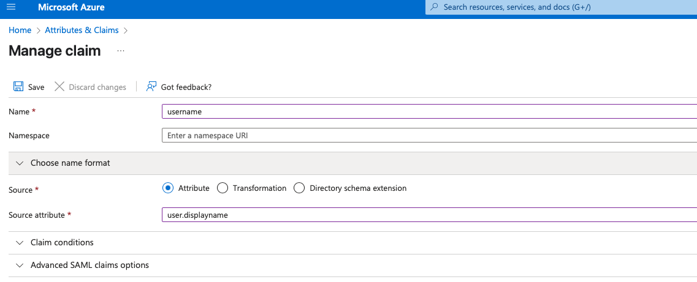

### Register the Application
Go to **App Registrations** → **All Applications**, and you will find the app you just created.
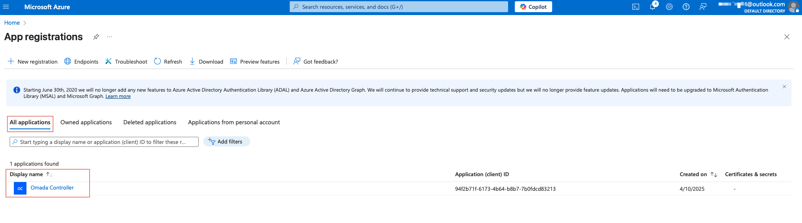
Click into the app, and under **Manage** → **App roles**, click **Create app role**.
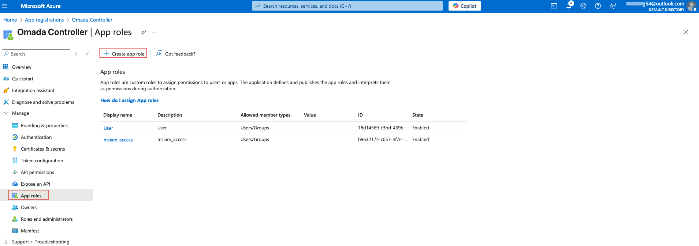
Configure the app role as shown below. You can set the **Display name** and **Description** as needed, but make sure the **Value** matches the SAML Role configured on the Omada Controller.
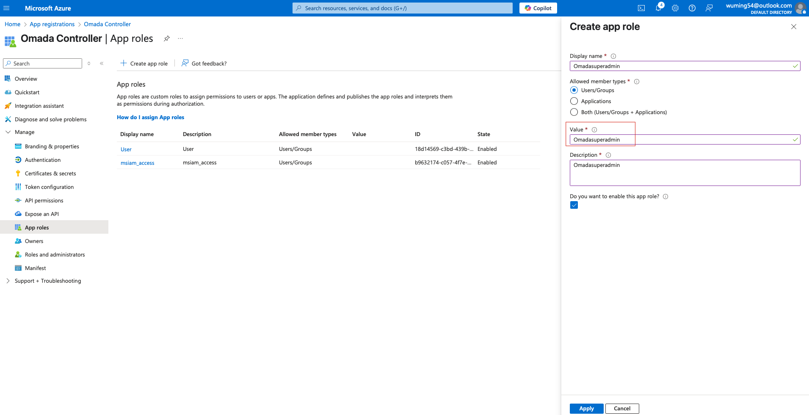

### Add Users to the App
Return to **Enterprise applications** → **Omada Controller**, and under **Manage** → **Users and Groups**, click **Add user/group** to add a new user.
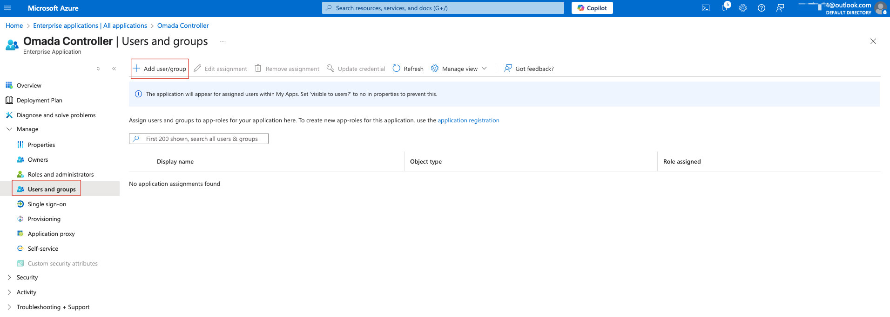
Select a user from Microsoft Azure AD, choose the role you just created, and assign it.
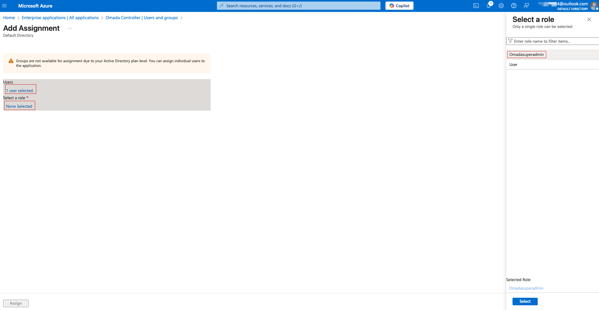

## Test the SSO
Now that you have set up Omada SSO with Microsoft Azure and added a user with Omada superadmin authorization, you can test it.

### Test SSO from Microsoft Azure
Go back to **Enterprise applications** → **Omada Controller** → **Manage** → **Single Sign-on**, then go to **Test** → **Test Sign in**.
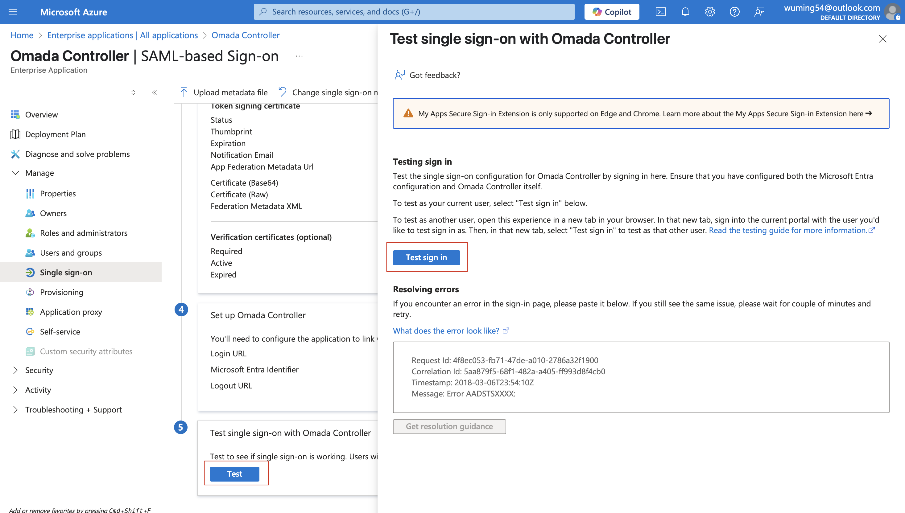
You will be redirected to the authentication page. Choose an account and log in.
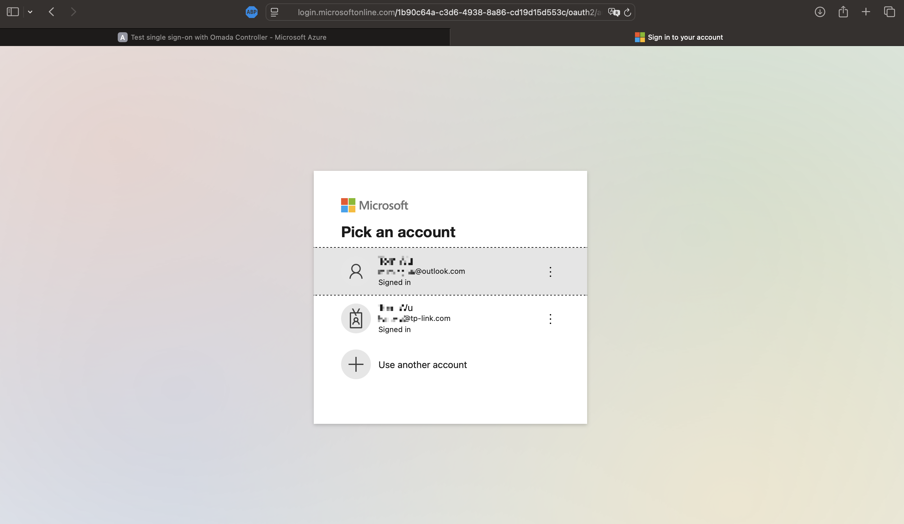
After successfully logging in to the Controller, you can see the SAML users on the controller.
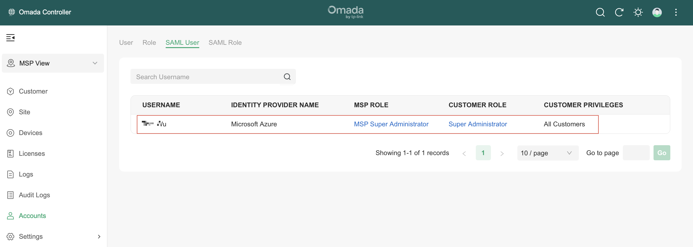

### Test SSO from the App Portal
Since Omada Controller currently only supports IdP-initiated SSO, you need an app portal as an entry point. For example, you can use https://myapplications.microsoft.com. After logging in with your account, you will find the app. Click it to log in.
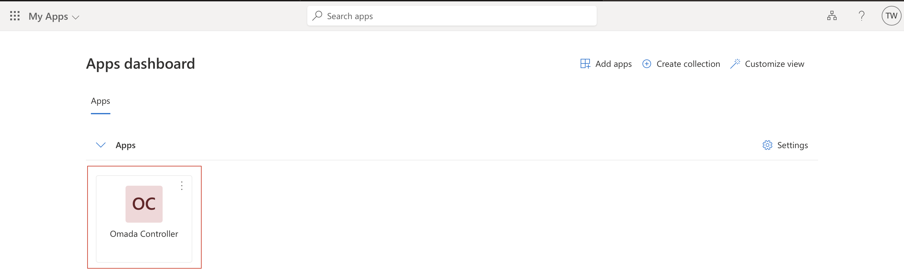

## Frequently Asked Questions
* **What if I get the error "browser is not compatible"?**
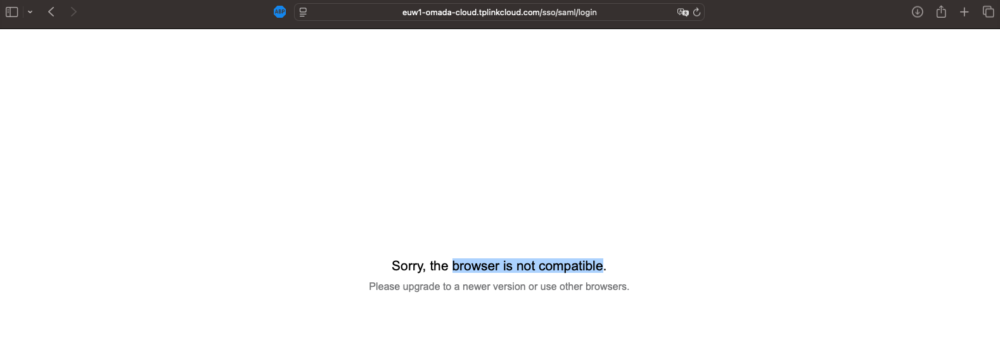
**A**: Check whether you are using the correct Reply/Sign-On URL. In this example, https://euw1-omada-**cloud**.tplinkcloud.com/sso/saml/login was used by mistake instead of the correct https://euw1-omada-**account**.tplinkcloud.com/sso/saml/login.
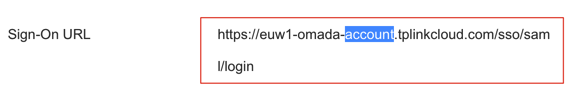

