# Configuring Google Workspace as an IdP for Omada Controller SAML SSO

This guide walks you through setting up Google Workspace as a SAML identity provider (IdP) for Omada Controller single sign-on (SSO).

## Prerequisites

- An administrator account in Google Workspace
- Omada Controller version 5.15.20 or later (with SAML SSO support enabled)

## Part 1: Initial Google Workspace Configuration

### Step 1: Access Google Admin Console

Sign in to the [Google Admin Console](https://admin.google.com/) with an administrator account. Personal accounts cannot access this console.

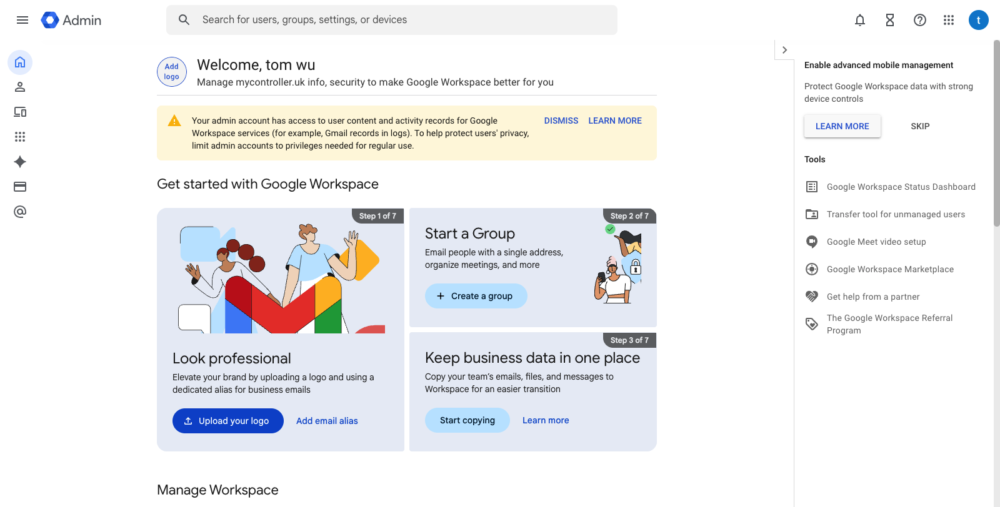

### Step 2: Create a Custom SAML Application

1. Navigate to **Apps** → **Web and mobile apps**
2. Click **Add app** and select **Add custom SAML app**

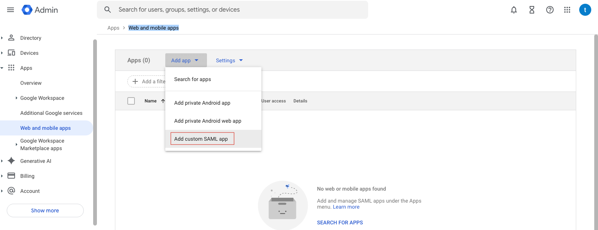

3. Enter a descriptive name for your application

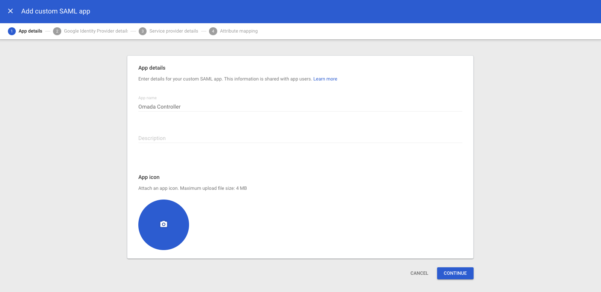

4. On the next screen, click **DOWNLOAD METADATA** to save the SAML metadata file. You’ll need this file to configure the Omada Controller.

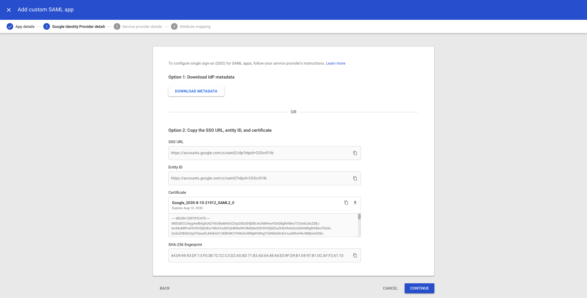

5. For now, skip the service provider details configuration—you’ll need information from the Omada Controller first.

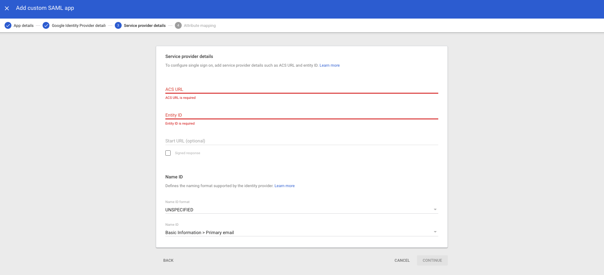

## Configuring Omada Controller for SAML

### Step 3: Create a SAML Role

1. Log in to the Omada Controller
2. Navigate to **Global View** → **Account** → **SAML Account**
3. Click **Add New SAML Role** to create a new role for SAML users

The SAML Role Name you create here will be used as the `usergroup_name` attribute in Google Workspace.

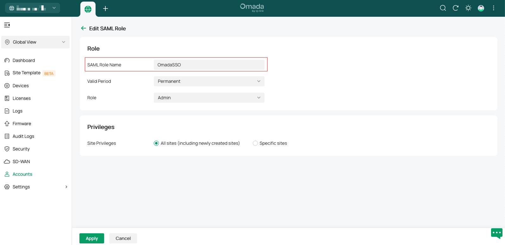

### Step 4: Create a SAML Connection

1. Navigate to **Global View** → **Settings** → **SAML SSO**
2. Click **Add New SAML Connection**

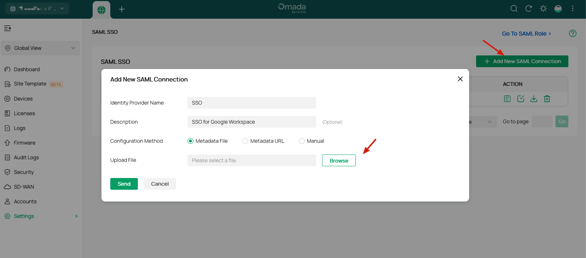

3. Fill in the connection details:
   - **Identity Provider Name**: Enter a name to identify this connection
   - **Configuration Method**: Select **Metadata File**
   - Browse and upload the SAML metadata file you downloaded from Google Workspace
   - Click **Send** to save

4. After the connection is created, click the menu icon to view the connection details. Note down the following values—you’ll need them to complete the Google Workspace configuration:
   - **Entity ID**
   - **Sign-On URL**
   - **Resource ID**
   - **Omada ID**

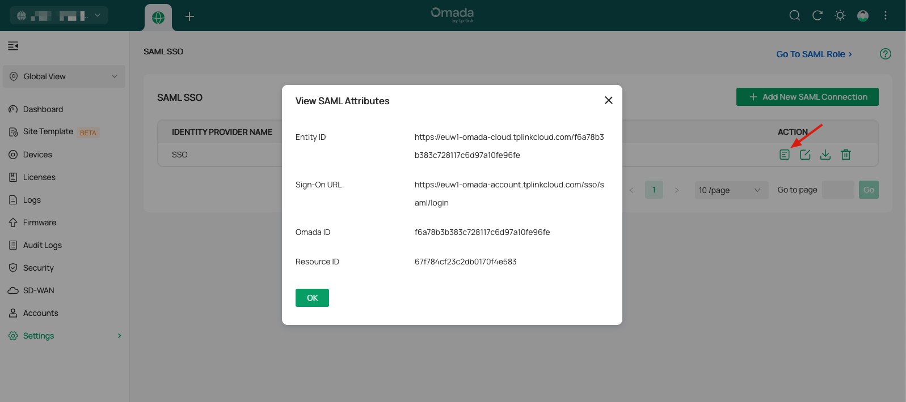

## Part 2: Complete Google Workspace Configuration

### Step 5: Configure Service Provider Details

Return to the Google Workspace SAML app and configure the service provider details:

1. **ACS URL**: Enter the Sign-On URL from Omada Controller
2. **Entity ID**: Enter the Entity ID from Omada Controller
3. **Start URL** (required): This is the Base64-encoded value of `Resource ID_Omada ID` from Omada Controller

To encode the Start URL, use an online Base64 encoder (e.g., [base64encode.net](https://www.base64encode.net/)) with the format: `Resource ID_Omada ID`

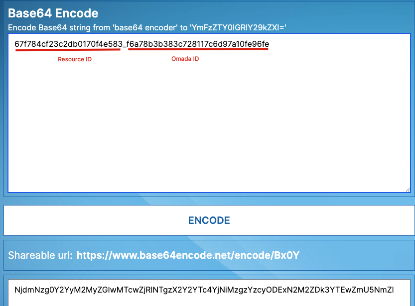

4. Fill in all required fields and proceed to the next step

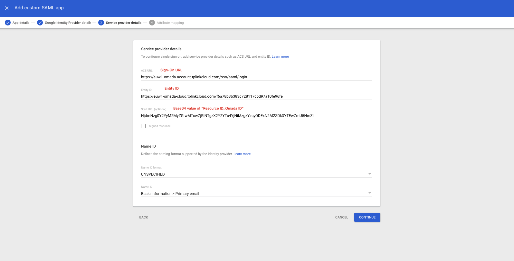

5. You’ll configure attribute mappings in the next step, so click **Finish** to save for now

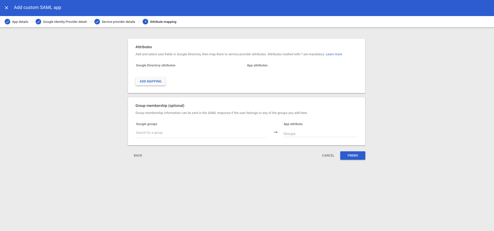

### Step 6: Add Custom Attributes to Google Workspace

Omada Controller requires two SAML attributes: `username` and `usergroup_name`.

1. Navigate to **Directory** → **Users**
2. Click **More Options** and select **Manage custom attributes**

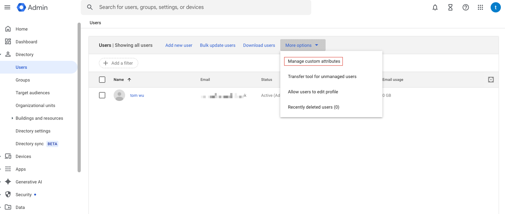

3. Click **ADD CUSTOM ATTRIBUTE** and configure:
   - **Category**: Enter a category name (e.g., “Omada”)
   - **Description**: Describe the attribute (e.g., “Omada user group”)
   - **Name**: Use `usergroup_name`
   - **Info Type**: Select **Text**
   - **Visibility**: Select **Visible to users and admins**
   - **Number of Values**: Select **Single Value**
   - Click **Save**

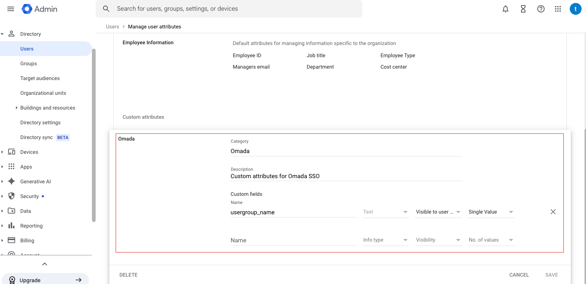

4. Now assign this attribute to your SAML test user:
   - Navigate back to **Directory** → **Users**
   - Select the user who will test SSO
   - Click into the user’s details and find the custom attribute you just created

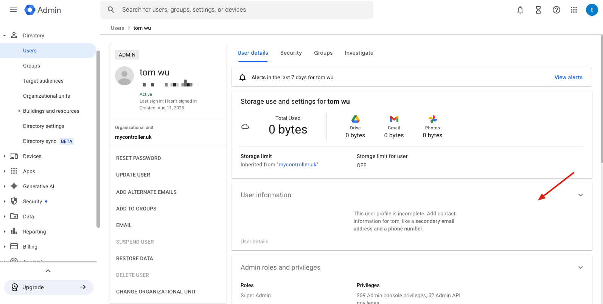

5. Set the attribute value to match the SAML Role Name you created in Omada Controller, then save

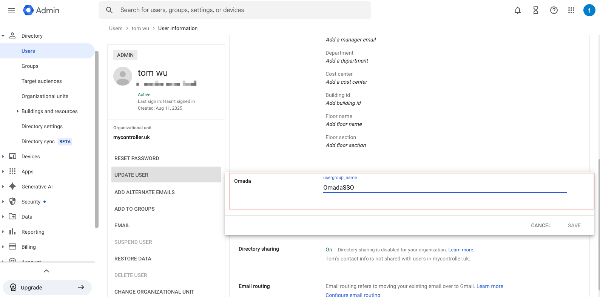

### Step 7: Map Attributes in the SAML App

1. Return to your SAML application in Google Workspace
2. Click **Attribute Mapping** and add these two mappings:
   - **Google Directory attribute** `usergroup_name` → **SAML attribute** `usergroup_name`
   - **Google Directory attribute** `Primary email` (or custom attribute) → **SAML attribute** `username`

With these mappings, Google Workspace will include the required attributes in the SAML assertion sent to Omada Controller.

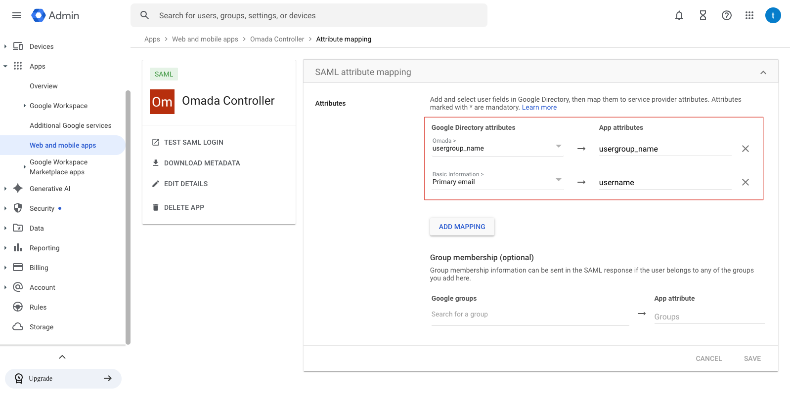

**Note**: Unlike Microsoft Azure AD, Google Workspace doesn’t have built-in application roles. We use custom attributes instead. Alternatively, you can map Google Groups to the `usergroup_name` attribute.

## Testing SAML SSO

### Step 8: Verify SAML Login

1. In your Google Workspace SAML app, click **TEST SAML LOGIN**

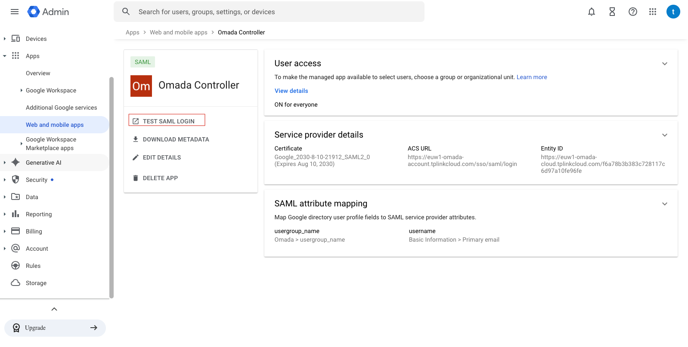

2. You’ll be redirected to Google’s login page. Select the test user account you configured earlier

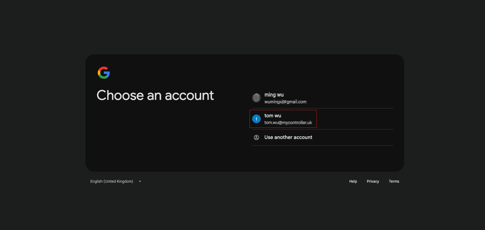

3. After successful authentication, you should be redirected to the Omada Controller. Log in and verify that the SAML user appears in **Global View** → **Account** → **SAML User**

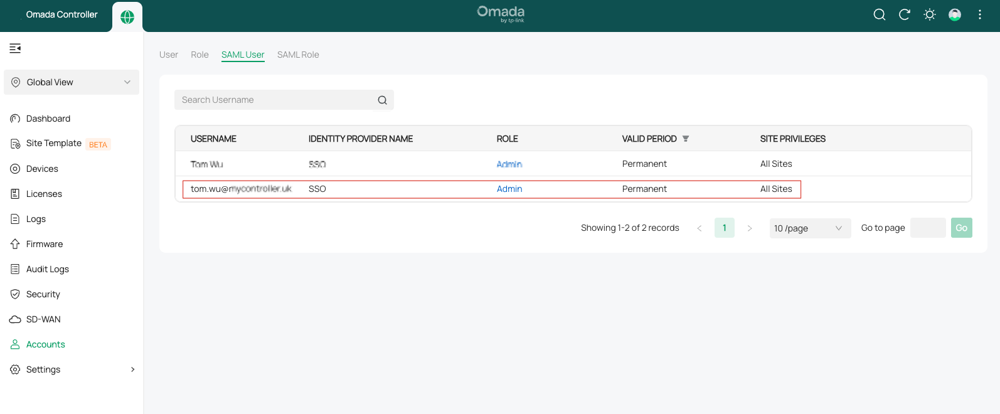

## Troubleshooting

If SAML login fails, use the SAML-tracer browser extension to inspect the SAML messages:

1. Install the SAML-tracer extension in Chrome or Firefox (search “SAML-tracer” in your browser’s extension store)

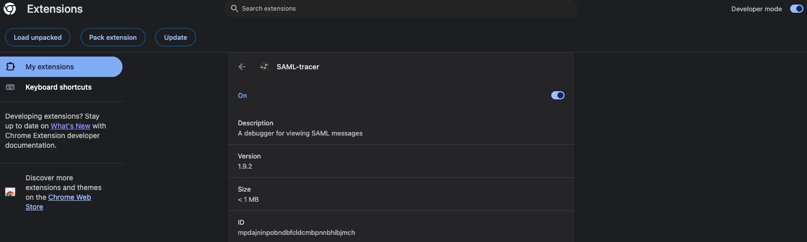

2. Click the SAML-tracer icon to open the debugging panel

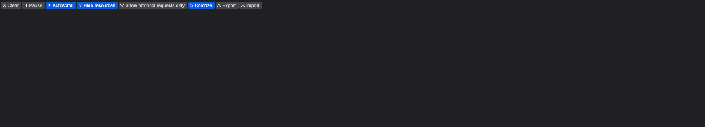

3. Repeat the SAML SSO login attempt. SAML-tracer will capture the SAML request and response. Verify that:
   - The `usergroup_name` and `username` attributes are present
   - The values match what you configured in Omada Controller

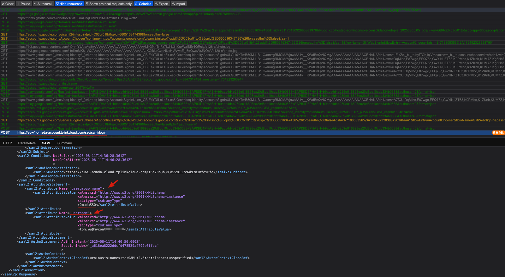

4. If you cannot resolve the issue, export the SAML messages from SAML-tracer and send them to your system administrator or support team for analysis

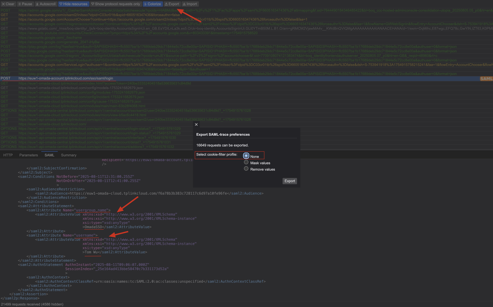